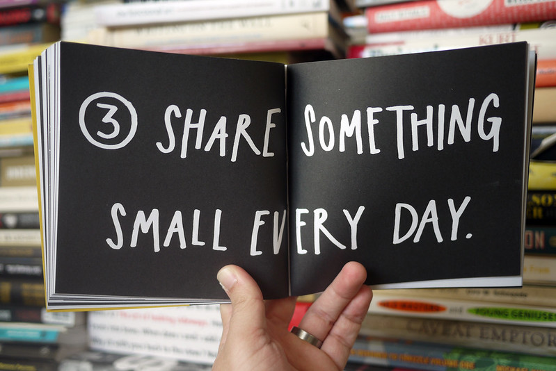

+++
author = "Michael"
title = "A post per day, here's the plan!"
date = "2022-01-02"
description = "My plan for 2022 to get me sharing more music and behind the scenes"
categories = [
  "dailyposts",
]
tags = [
  "Thoughts",
  "Daily posts"
]
image = "a-post-per-day.jpg"
+++

## The usual

The regular release cycle for music that I work on is currently something like this...

1. Work for months in secret writing, recording, mixing, designing artwork etc... 👎
2. Mention occasionally on social media that I'm working on {{ insert project here }} with no context 👎
3. Release project, be it an EP, Album, Music Video etc... 👎
4. Promote it for a week by telling people "hey look, I made this" 👎
5. Disappear for another few months 👎

I've been told that if you want to build a fanbase that what I've been doing all this time is the wrong approach, who would have guessed! 

## Show Your Work!

I recently read most (still a bit to go) of [Show Your Work!](https://www.amazon.co.uk/Show-Your-Work-Getting-Discovered/dp/076117897X) by Austin Kleon. It's a book for artists, musicians, makers of all shapes and sizes. The book encourages you to show your work. 

The part of this that is important to this project is "3. Share Something Small Every Day", the inspiration for this project. 

The plan is to follow this advice and commit to sharing something, some piece of content everyday, minus Sundays. My new release cycle for music will be something like this. 

1. Spend 30 minutes at my computer songwriting 🖥️
2. Share the result! 🤘
3. Jot down some lyrics on my phone 📱
4. Share the result! 🤘
5. Go to my rehearsal room and record some drums 🥁
6. Share the result! 🤘
7. Record a rough demo of a song 🎤
8. Share the result! 🤘

I think you see where this is going...

## Follow along

So to follow along the best place to see all of this will probably be here at [michaeloconnellmusic.com](https://michaeloconnellmusic.com) or my [Twitter](https://twitter.com/michaelocmusic/) where I will share each post that is on this website as soon as it is released, under the hashtag #mocdaily. 

Oh! and this post is going out Jan 2nd / 3rd but I wont be starting the daily post until Monday, Jan 10th. Not sure yet when the best time to post is, we'll try 17:30 and go from there.
